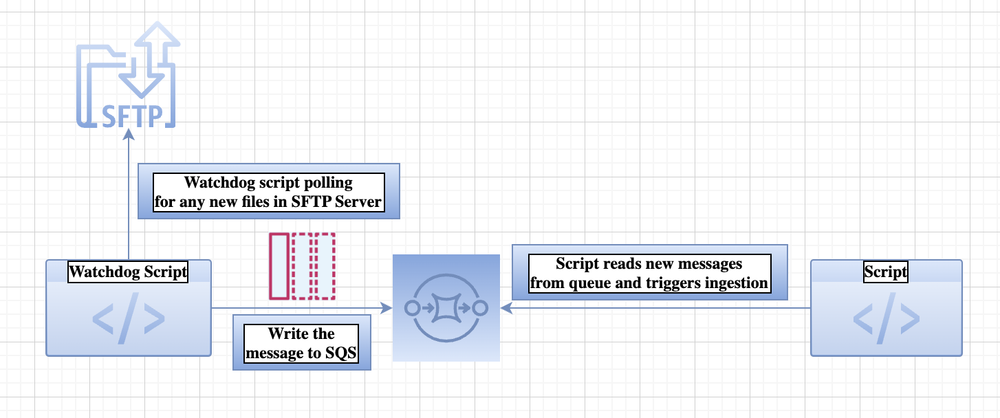

# SFTPFileWatcher

This repo consists of code that implements filewatcher process for SFTP Server.
 
There will be instances where the time of file landing to the sftp server is random and  
the use-case is to trigger ingestion pipeline when ever a new file lands in sftp server

This repo tries to solve this use-case where the file based ingestion will be triggered when the new files land in the SFTP server

# Architecture and Flow Chart

1. The watchdog process runs in the SFTP server and continuously monitors for any new file created/modified.
2. As soon as there are any new files detected, the information is pushed to the Azure Storage Queue or AWS SQS.
3. Another script checks for any new messages in the queue and triggers ingestion for the corresponding table. This script can either be run as a lambda function/cloud function/azure function or as a standalone script.

 

More details on this repo can be found here: https://abhr1994.medium.com/sftp-file-watcher-54824ddd9dcb